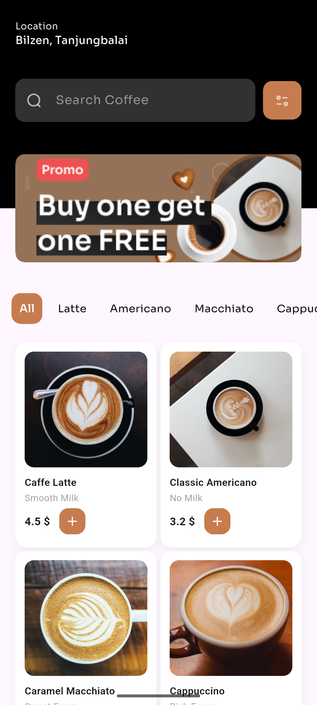

# Coffee Shop App (Flutter UI)

A simple Coffee Shop mobile app UI built using Flutter.

This project focuses only on the user interface.  
No backend or database is used.

---

## Features

- Modern coffee shop UI
- Scrollable home screen
- Category selection (All, Latte, Americano, Macchiato, Cappuccino)
- Grid view updates based on selected category
- Coffee cards display:
  - Image
  - Name
  - Subtitle
  - Price (formatted to 2 decimals)
  - Rating
- Search bar and filter button (UI only)

---

## Screenshots




---

## Tech Stack

- Flutter
- Dart
- Google Fonts (Sora)

---

## Project Structure

```
lib/
├── models/
│   └── coffee.dart
├── screens/
│   └── home_screen.dart
└── main.dart
```

---

## Notes

- UI-only implementation
- No backend, API, or database
- Coffee data is hardcoded
- Category-based filtering is handled on the UI

---

## Getting Started

1. Clone the repository
2. Run `flutter pub get`
3. Add required assets in `pubspec.yaml`
4. Run the app using `flutter run`

---

## Future Improvements

- Search functionality
- Coffee detail screen
- Cart and checkout
- Backend integration

---

Built using Flutter
