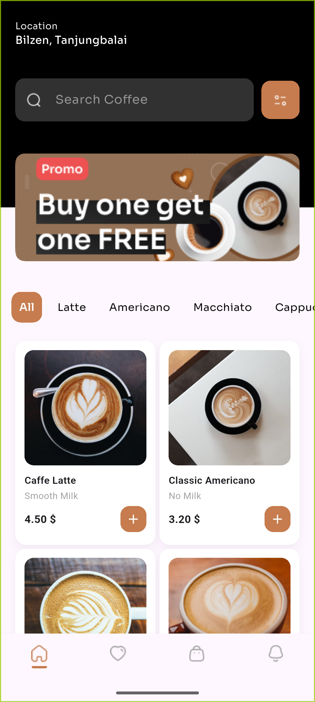
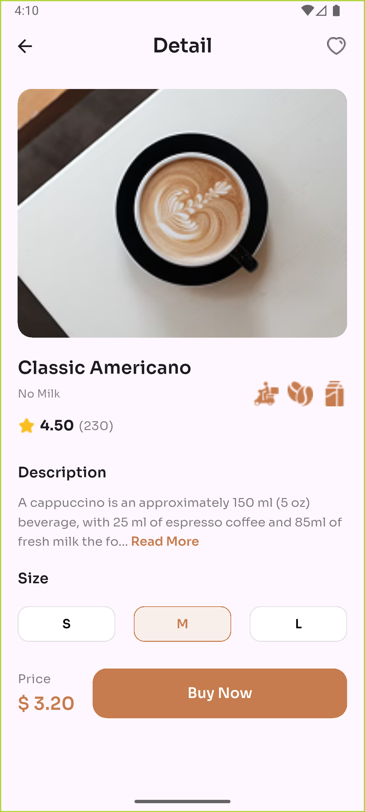

# Coffee Shop App (Flutter UI)

A modern Coffee Shop mobile application UI built using Flutter and Dart.
The app uses a bottom navigation screen to switch between main sections.

## Features

- Bottom navigation screen (Home, Favorites, Cart, Profile)[currenty only homescreen exists]
- Coffee category selection (All, Latte, Americano, Macchiato, Cappuccino)
- Dynamic filtering of coffee items based on category
- Home screen with search bar UI
- Grid view displaying coffee image, name, subtitle, price, and rating
- Coffee detail screen with image, description, size selector (S / M / L), price display, and Buy Now button
- Smooth and responsive UI
- UI-only project (no backend integration)

## Tech Stack

- Flutter
- Dart
- Google Fonts (Sora)

## Project Structure

lib/
├── models/
│   └── coffee.dart
├── screens/
│   ├── navigation/
│   │   └── nav_screen.dart
│   ├── home/
│   │   └── home_screen.dart
│   └── coffee/
│       └── coffee_detail_screen.dart
└── main.dart

## Screenshots

  
  
  

screenshots/
├── home_screen.png
└── detail_screen.png

## Getting Started

Prerequisites:
- Flutter SDK
- Android Emulator, iOS Simulator, or physical device

Steps:
1. git clone https://github.com/Nissan-Shrestha/Coffee-Shop-App.git
2. cd Coffee-Shop-App
3. flutter pub get
4. flutter run

## Notes

- This project is UI only
- Search functionality is not implemented
- No backend, authentication, or cart logic included

## Future Improvements

- Implement search functionality
- Add cart and checkout flow
- Connect to backend or Firebase
- Add state management (Provider, Riverpod, Bloc)
- Improve animations and transitions
- Add dark mode
- Add all screens

## License

Open source project for learning and personal use.
